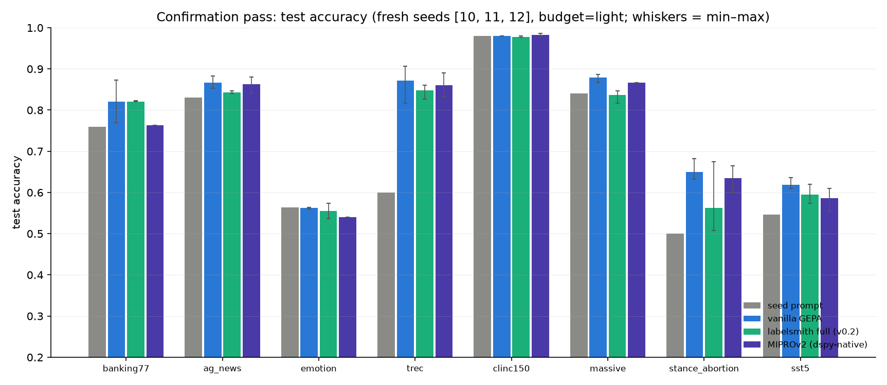

| arm | banking77 | ag_news | emotion | trec | clinc150 | massive | stance_abortion | sst5 | mean |
|---|---|---|---|---|---|---|---|---|---|
| **accuracy** | | | | | | | | | |
| seed prompt | 0.760 | 0.830 | 0.563 | 0.600 | 0.980 | 0.840 | 0.500 | 0.547 | **0.703** |
| vanilla GEPA | 0.821 | 0.867 | 0.562 | 0.871 | 0.980 | 0.879 | 0.650 | 0.619 | **0.781** |
| labelsmith full (v0.2) | 0.821 | 0.843 | 0.556 | 0.848 | 0.978 | 0.837 | 0.563 | 0.596 | **0.755** |
| MIPROv2 (dspy-native) | 0.763 | 0.863 | 0.540 | 0.860 | 0.982 | 0.867 | 0.635 | 0.587 | **0.762** |
| **macro-F1** | | | | | | | | | |
| seed prompt | 0.737 | 0.823 | 0.455 | 0.624 | 0.980 | 0.847 | 0.433 | 0.454 | **0.669** |
| vanilla GEPA | 0.804 | 0.865 | 0.458 | 0.860 | 0.980 | 0.895 | 0.639 | 0.592 | **0.761** |
| labelsmith full (v0.2) | 0.813 | 0.838 | 0.446 | 0.850 | 0.977 | 0.849 | 0.517 | 0.561 | **0.731** |
| MIPROv2 (dspy-native) | 0.740 | 0.861 | 0.447 | 0.861 | 0.982 | 0.875 | 0.616 | 0.577 | **0.745** |

Confirmation-pass spend: **$15.61**

