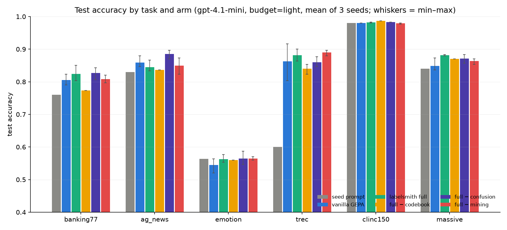
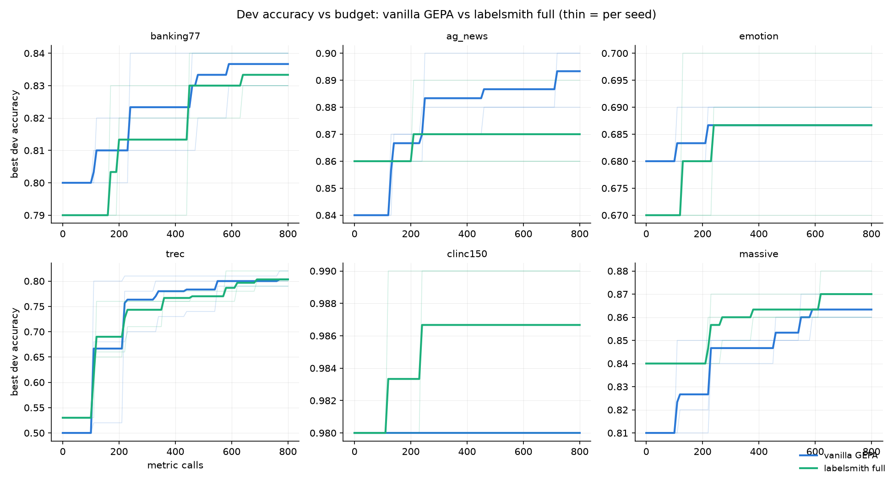

<!-- generated by benchmarks/make_report.py -->

## Overall (mean of task means, test accuracy)

| arm | banking77 | ag_news | emotion | trec | clinc150 | massive | mean |
|---|---|---|---|---|---|---|---|
| seed prompt | 0.760 | 0.830 | 0.563 | 0.600 | 0.980 | 0.840 | **0.762** |
| vanilla GEPA | 0.806 | 0.859 | 0.544 | 0.862 | 0.980 | 0.849 | **0.817** |
| labelsmith full | 0.824 | 0.844 | 0.562 | 0.881 | 0.982 | 0.881 | **0.829** |
| full − codebook | 0.773 | 0.837 | 0.560 | 0.840 | 0.987 | 0.870 | **0.811** |
| full − confusion | 0.827 | 0.886 | 0.564 | 0.860 | 0.983 | 0.871 | **0.832** |
| full − mining | 0.808 | 0.850 | 0.564 | 0.890 | 0.979 | 0.863 | **0.826** |

### banking77

| arm | test accuracy (3 seeds) | test macro-F1 | dev acc | cost/run |
|---|---|---|---|---|
| seed prompt | 0.760 | 0.737 | — | $0.02 |
| vanilla GEPA | 0.806 [0.790–0.823] | 0.786 [0.771–0.802] | 0.837 [0.830–0.840] | $0.31 |
| labelsmith full | 0.824 [0.803–0.850] | 0.816 [0.786–0.847] | 0.877 [0.870–0.880] | $0.29 |
| full − codebook | 0.773 [0.773–0.773] | 0.751 [0.751–0.751] | 0.850 [0.850–0.850] | $0.11 |
| full − confusion | 0.827 [0.807–0.843] | 0.818 [0.797–0.840] | 0.867 [0.850–0.890] | $0.18 |
| full − mining | 0.808 [0.797–0.820] | 0.794 [0.782–0.806] | 0.833 [0.830–0.840] | $0.12 |
| full → `gpt-4.1-nano` (transfer) | 0.742 [0.730–0.763] | 0.727 [0.701–0.758] | — | $0.02 |

### ag_news

| arm | test accuracy (3 seeds) | test macro-F1 | dev acc | cost/run |
|---|---|---|---|---|
| seed prompt | 0.830 | 0.823 | — | $0.01 |
| vanilla GEPA | 0.859 [0.847–0.880] | 0.856 [0.842–0.879] | 0.893 [0.880–0.900] | $0.26 |
| labelsmith full | 0.844 [0.833–0.867] | 0.840 [0.828–0.866] | 0.920 [0.920–0.920] | $0.21 |
| full − codebook | 0.837 [0.837–0.837] | 0.833 [0.833–0.833] | 0.900 [0.900–0.900] | $0.08 |
| full − confusion | 0.886 [0.870–0.897] | 0.885 [0.869–0.897] | 0.933 [0.920–0.950] | $0.16 |
| full − mining | 0.850 [0.823–0.873] | 0.846 [0.815–0.873] | 0.883 [0.860–0.900] | $0.05 |
| full → `gpt-4.1-nano` (transfer) | 0.821 [0.817–0.830] | 0.823 [0.816–0.837] | — | $0.01 |

### emotion

| arm | test accuracy (3 seeds) | test macro-F1 | dev acc | cost/run |
|---|---|---|---|---|
| seed prompt | 0.563 | 0.455 | — | $0.01 |
| vanilla GEPA | 0.544 [0.520–0.563] | 0.434 [0.406–0.455] | 0.687 [0.680–0.690] | $0.19 |
| labelsmith full | 0.562 [0.553–0.577] | 0.467 [0.460–0.481] | 0.730 [0.710–0.750] | $0.23 |
| full − codebook | 0.560 [0.560–0.560] | 0.447 [0.447–0.448] | 0.733 [0.730–0.740] | $0.14 |
| full − confusion | 0.564 [0.547–0.587] | 0.466 [0.453–0.485] | 0.733 [0.720–0.740] | $0.15 |
| full − mining | 0.564 [0.560–0.570] | 0.461 [0.454–0.470] | 0.687 [0.670–0.700] | $0.04 |
| full → `gpt-4.1-nano` (transfer) | 0.497 [0.460–0.550] | 0.428 [0.394–0.471] | — | $0.01 |

### trec

| arm | test accuracy (3 seeds) | test macro-F1 | dev acc | cost/run |
|---|---|---|---|---|
| seed prompt | 0.600 | 0.624 | — | $0.01 |
| vanilla GEPA | 0.862 [0.803–0.917] | 0.861 [0.827–0.910] | 0.803 [0.790–0.820] | $0.33 |
| labelsmith full | 0.881 [0.863–0.900] | 0.879 [0.867–0.891] | 0.877 [0.860–0.900] | $0.17 |
| full − codebook | 0.840 [0.823–0.853] | 0.800 [0.723–0.845] | 0.800 [0.750–0.850] | $0.14 |
| full − confusion | 0.860 [0.847–0.877] | 0.866 [0.862–0.873] | 0.817 [0.810–0.820] | $0.13 |
| full − mining | 0.890 [0.880–0.897] | 0.886 [0.878–0.890] | 0.817 [0.800–0.830] | $0.05 |
| full → `gpt-4.1-nano` (transfer) | 0.562 [0.460–0.623] | 0.558 [0.463–0.607] | — | $0.01 |

### clinc150

| arm | test accuracy (3 seeds) | test macro-F1 | dev acc | cost/run |
|---|---|---|---|---|
| seed prompt | 0.980 | 0.980 | — | $0.02 |
| vanilla GEPA | 0.980 [0.980–0.980] | 0.980 [0.980–0.980] | 0.980 [0.980–0.980] | $0.06 |
| labelsmith full | 0.982 [0.980–0.983] | 0.982 [0.980–0.983] | 0.993 [0.990–1.000] | $0.09 |
| full − codebook | 0.987 [0.987–0.987] | 0.987 [0.987–0.987] | 0.990 [0.990–0.990] | $0.01 |
| full − confusion | 0.983 [0.983–0.983] | 0.983 [0.983–0.983] | 0.990 [0.990–0.990] | $0.02 |
| full − mining | 0.979 [0.977–0.980] | 0.979 [0.976–0.980] | 0.987 [0.980–0.990] | $0.03 |
| full → `gpt-4.1-nano` (transfer) | 0.972 [0.963–0.977] | 0.972 [0.963–0.977] | — | $0.01 |

### massive

| arm | test accuracy (3 seeds) | test macro-F1 | dev acc | cost/run |
|---|---|---|---|---|
| seed prompt | 0.840 | 0.847 | — | $0.02 |
| vanilla GEPA | 0.849 [0.837–0.873] | 0.863 [0.848–0.888] | 0.863 [0.860–0.870] | $0.29 |
| labelsmith full | 0.881 [0.880–0.883] | 0.893 [0.892–0.895] | 0.910 [0.900–0.920] | $0.26 |
| full − codebook | 0.870 [0.870–0.870] | 0.875 [0.875–0.875] | 0.890 [0.890–0.890] | $0.14 |
| full − confusion | 0.871 [0.857–0.883] | 0.878 [0.867–0.889] | 0.903 [0.900–0.910] | $0.18 |
| full − mining | 0.863 [0.853–0.870] | 0.867 [0.850–0.880] | 0.877 [0.860–0.900] | $0.09 |
| full → `gpt-4.1-nano` (transfer) | 0.811 [0.787–0.837] | 0.816 [0.783–0.855] | — | $0.02 |

Total measured spend for the matrix: **$13.94**
