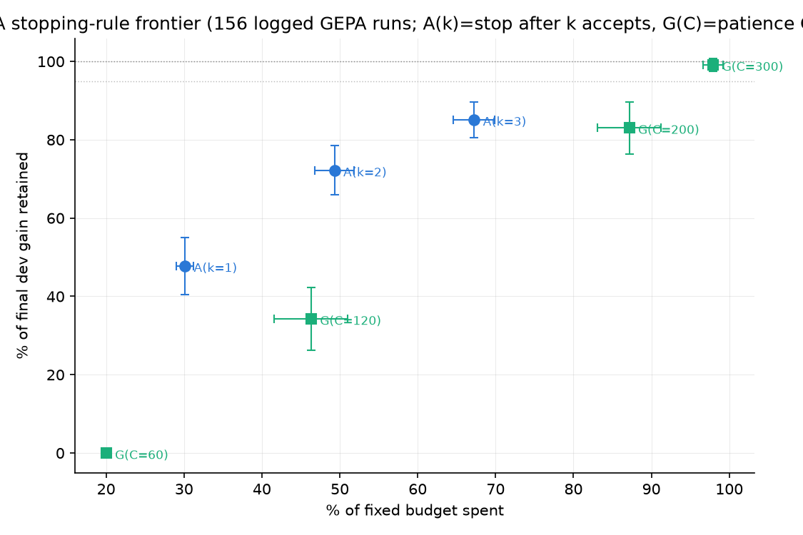
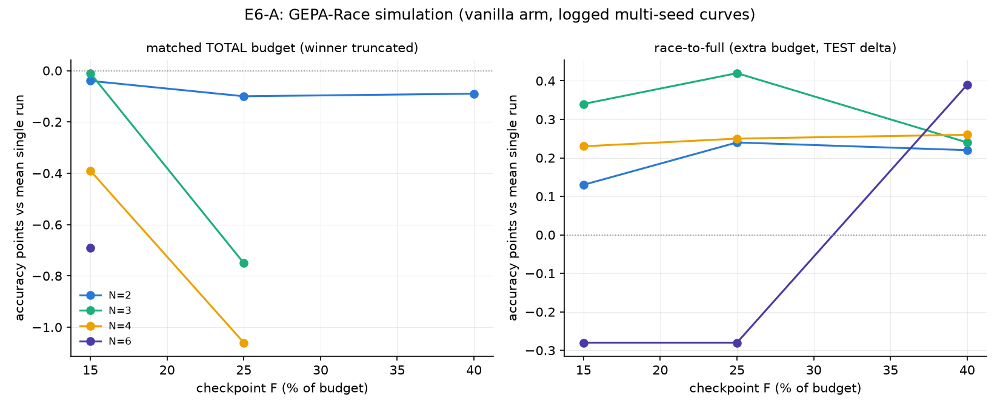
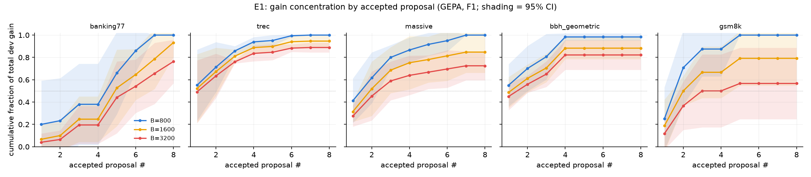

# Mechanistic campaign — results

Claims C1–C8 from the campaign brief; one section per experiment, each with an
honest verdict (survived / narrowed / died) and the sentence we'd put in the
paper. Iteration vs confirmation outputs are marked. Baseline reference:
`benchmarks/RESULTS.md` confirmation pass (vanilla GEPA 0.781 mean test, fresh
seeds 10–12, budget 780/"light").

## E5 Phase A — adaptive-budget stopping rules (C5) · SIMULATION, $0 · **complete**

Setup: 156 logged GEPA runs pooled from the v0.1 matrix, v0.2 iteration, and
the confirmation pass (`curve_pool.jsonl`); rules computable exactly from
accepted-candidate curves — A(k) = stop after the k-th accepted candidate,
G(C) = stop after C metric calls without a new accept. (Proposal-count rules
like "k consecutive rejections" are NOT simulable from our logs: curves cannot
distinguish gepa's skip iterations from rejected proposals; noted for E1's
instrumentation, which will log both.) 119 runs with total gain ≥ 0.005 scored.

| rule | % budget spent | % dev gain retained | median | full-retention runs |
|---|---|---|---|---|
| A(1) | 30% ± 1% | 47.8% ± 7.3% | 50% | 24% |
| **A(2)** | **49% ± 2%** | **72.2% ± 6.3%** | **89%** | 44% |
| A(3) | 67% ± 3% | 85.1% ± 4.5% | 100% | 61% |
| G(120) | 46% ± 5% | 34.3% ± 8.0% | 0% | 24% |
| G(200) | 87% ± 4% | 83.0% ± 6.7% | 100% | 82% |
| G(300) | 98% ± 1% | 99.2% ± 1.7% | 100% | 99% |

**Verdict: C5 NARROWED.** The success bar (≥90–95% retention at ≤50% budget)
is not met: the best ~50%-budget rule (A(2)) retains 72% of dev gain (median
89% — the mean is dragged by a minority of runs whose late accepts matter).
Two structural reasons, both worth reporting: (i) full dev evals dominate
accepted-candidate cost (~106 calls each of 800), bounding what any stopping
rule can save; (ii) late accepts contribute more than the front-loading story
predicted — which also feeds the C1 verdict below. Paper sentence: *"Simple
stopping rules trade roughly linearly: ~70% of the achievable gain at half the
budget, ~85% at two-thirds — useful budget knobs, but no free lunch; the
retention ceiling is set by evaluation overhead, not proposal count."*
Phase B (live) decision: run only if E1's richer instrumentation suggests a
hybrid rule (accept-count + patience) clearing ~85% retention at ≤60%; the
pure rules here don't justify prospective spend yet.

Side-finding feeding C1: across 119 runs the FIRST accepted proposal carries a
median 50% (mean 48%) of total dev gain — substantial, but far from the "large
majority" the pilot's single-task observation suggested. C1 is already
weakening before E1 runs; E1 will quantify across budgets/optimizers/families.

## E6 Phase A — GEPA-Race simulation (C6) · SIMULATION, $0 · **complete**

Setup: race N ∈ {2,3,4,6} logged same-config vanilla trajectories (6 seeds/task
on six tasks, 3 on two), checkpoint F ∈ {15%,25%,40%}, winner = dev leader at
F·T. Two accountings, per the brief. 90–122 seed-subsets per cell (sampled).
Positioning: CAPO (arXiv:2504.16005) races candidate prompts within a run; this
races whole trajectories.

Matched TOTAL budget (winner truncated to T·(1−(N−1)F)): **every cell ≤ 0**
(best −0.0001, worst −0.0106 dev vs the mean single full run). Race-to-full
(1.3–2.5× budget): +0.1 to +0.4 test points vs the mean seed — within or near
CI of zero — and **always negative vs the luckiest seed** (−1.1 to −3.0).

**Verdict: C6 DIED in simulation.** Early-checkpoint dev rank is too weakly
predictive of final rank for trajectory selection to pay for its parallel
starts; at honest matched-budget accounting racing never wins, and the
race-to-full gains are luck-harvesting that a "report the luckiest seed"
skeptic already owns. Paper sentence: *"Racing optimization trajectories
recovers only seed-selection luck: at matched total budget it never beats a
single full run, because early dev standing is a poor predictor of final
standing."* E6 Phase B: **cancelled** (simulation is decisive; the live
mechanism it can't capture — different post-checkpoint reflections — has no
channel to overcome a negative matched-budget baseline). This negative is
itself paper material alongside C1's weakening: both say the early signal is
noisier than the front-loading story implied.

## E8 — diagnose-then-write (C8) · **FROZEN RESULTS** (no changes after these numbers)

Frozen pass complete (8 tasks × 2 families × seeds 20–24 + GEPA-F2 references;
$42.62). Mean test accuracy across the 8 tasks:

| family | seed | ×1 | ×2 | GEPA B1 | ×2 recovery of GEPA gain | ×2 optimize cost |
|---|---|---|---|---|---|---|
| F1 gpt-4.1-mini/4.1 | 0.703 | 0.740 | 0.747 | 0.776 | **60%** | ~10–15% of GEPA's |
| F2 haiku-4.5/sonnet-4.5 | 0.742 | 0.761 | 0.771 | 0.774 | **91%** | ~10–15% of GEPA's |

Per-task recovery is strongly heterogeneous (F1: banking77 155%, massive 112%,
trec 94% — but stance_abortion **−18%**, ag_news 24%, sst5 30%; F2: stance 86%,
massive 82%, trec 47%, with banking77/emotion exceeding GEPA outright).
clinc150 flat/saturated both families, sst5 flat on F2. GEPA-F1 reference =
existing vanilla pool (seeds 0–2, 10–12); GEPA-F2 = fresh runs (seeds 20–24).

**Verdict: C8 NARROWED to a strong cost result, not a replacement claim.**
The ≥80–90%-recovery-at-≤15%-cost bar is met on F2 (91%) but not on F1's mean
(60%) — and F1's failures cluster exactly where whole-prompt iteration
discovers global strategies a one-shot diagnosis can't (stance_abortion, the
same task that broke the per-label codebook). Paper sentence: *"A single
error-grounded rewrite recovers 60–91% of GEPA's gain (family-dependent) at
about a tenth of its cost — supporting a screen → diagnose-then-write →
evolve-if-headroom pipeline — but on tasks requiring globally restructured
prompts, iterative evolution remains necessary."* Iteration-pass numbers held
under fresh seeds (banking77 0.849→0.843, trec 0.856→0.852). Pending for the
final tables: paired bootstrap CIs (per-example scores recomputable from saved
prompts via the temp-0 cache at ~zero cost).

### Iteration-phase record (pre-freeze)

Iteration (banking77 + trec, F1, seeds 0–1, ~$0.91): seed→×1→×2 test accuracy
0.760→0.811→**0.849** on banking77 (GEPA reference 0.821 — exceeded) and
0.600→0.792→**0.856** on trec (GEPA 0.871 — 94% of gain recovered), at
~15–25% of GEPA's optimization spend. Headline candidate.

**FROZEN protocol (registered before any frozen run):** code as committed at
freeze; all 8 prepped datasets; families F1 (gpt-4.1-mini / gpt-4.1) and F2
(claude-haiku-4.5 / claude-sonnet-4.5); fresh seeds 20–24; arms seed / ×1 / ×2
from one script run per (task, family, seed). GEPA references: F1 = existing
vanilla runs (seeds 0–2 v0.1 + 10–12 confirmation, reported as such); F2 = new
vanilla GEPA at B1, seeds 20–24. Metrics: test accuracy, macro-F1, recovery
fraction (arm − seed)/(GEPA − seed), cost per arm; mean ± 95% CI over seeds;
paired bootstrap vs GEPA on identical test sets. No changes after numbers.

## E1 — front-loading (C1) · **COMPLETE** ($93.74)

Full matrix: GEPA × {800, 1600, 3200} × 5 tasks (banking77/trec/massive +
bbh_geometric + gsm8k) × 5 fresh seeds (30–34) on F1, with per-proposal-attempt
instrumentation; GEPA-F2 (claude) B1/B2 × 3 seeds; MIPROv2-F1 by preset tier
(light/medium/heavy; GSM8K-MIPROv2 dropped — budget parity uninterpretable;
TextGrad skipped — no maintained harness within a day). 165 runs, zero failures.

**Headline: C1 DIED as stated.** Median fraction of total dev gain from the
FIRST accepted proposal: **0.33** on F1 (n=73), **0.42** on F2 (n=30) — flat
across budgets B1→B3 (no concentration even at 4× budget), and strongly
task-dependent (trec 0.62–0.64, massive 0.29–0.33, banking77 0.00, gsm8k
0.00–0.25). Half of the gain needs ~2 accepts (median by-2 = 0.50); the rest
accrues across later accepts. MIPROv2's apparent 0.71 is measured at its own
full-eval checkpoints (2–4 per run) — a granularity artifact of its evaluation
schedule, reported with that caveat, so the cross-optimizer contrast is
qualified rather than claimed.

Paper sentence: *"Reflective prompt evolution's gains are distributed, not
front-loaded: across budgets, tasks, and two model families, the first accepted
rewrite carries a median one-third of the final improvement — refuting the
folk model in which one good rewrite does the work, and explaining why methods
that bank on early signal (racing, aggressive stopping, best-of-K round one)
underdeliver."* Secondary finding for practitioners: budget scaling is strongly
diminishing — 4× budget buys +1.4 test points on average (GEPA F1 0.811 →
0.825); GEPA beats MIPROv2 at every budget tier (replicating the benchmark
confirmation).

E1's 105 GEPA curves were folded into the simulation pool; the E5-A frontier
re-computed on 222 informative runs is unchanged in shape (A(2): 63% retention
at 38% budget; A(3): 75% at 51%; G(200): 90% at 92%) — C5's verdict stands
with better power.

## E7 — best-of-K first rewrite (C7) · **COMPLETE** ($6.37)

K=4 diverse first rewrites (distinct reflection cache namespaces + distinct
error samples), 25-example dev screen, winner promoted, vanilla continuation at
matched total budget; banking77/trec/massive × seeds 30–34 vs the E1 vanilla
B1 cells (identical seeds — paired comparison).

**Verdict: C7 DIED (clean null).** Paired mean test delta **+0.002 ± 0.009**
(banking77 +0.001, trec +0.010, massive −0.005). The screen itself works — the
K rewrites spread by a mean 7.2 accuracy points on the screen set and the
winner's first full-dev score averages 0.822 — but the head start washes out:
with gains distributed across many accepts (E1), evolution re-converges
regardless of the starting rewrite. Paper sentence: *"Investing budget in a
better first rewrite buys nothing at matched total budget (+0.2 ± 0.9 points):
the optimizer's later accepts redistribute whatever the first rewrite missed."*
Together with E6 (racing dead) and E5 (modest stopping frontier), all three
early-signal exploits fail for the same measured reason — a coherent negative
triad grounded in the E1 result.

## E4 — coarse-to-fine (C4) · iteration complete; **no confirmation warranted** ($4.58)

Iteration (marked exploratory; seeds 30–32, B1, 4 tasks): vanilla / full-layer /
c2f(rejections:2) / c2f(fraction:0.6, banking77 ablation).

| task | vanilla | full | c2f(rej2) | c2f(frac60) |
|---|---|---|---|---|
| banking77 | 0.826 | 0.821 | 0.818 | 0.786 |
| trec | 0.892 | 0.873 | 0.892 | — |
| massive | 0.858 | 0.850 | 0.858 | — |
| stance_abortion | 0.640 | 0.537 | 0.607 | — |

**Verdict: C4 DIED in iteration; freezing and confirming it would confirm a
non-method.** Mechanism, precisely: (i) the stall trigger (2 consecutive
rejections) fires so late that 14/15 runs had no budget left for phase 2 —
GEPA keeps accepting sporadically to the end (another face of the distributed-
gains result E1); c2f then equals vanilla minus overhead. (ii) When phase 2 is
forced early (fraction 0.6), refinement actively subtracts (−4.0 on banking77):
decomposed per-label editing degrades a good blob rather than sharpening it.
Paper sentence: *"Sequencing whole-prompt evolution before per-label refinement
does not rescue structure: evolution rarely stalls early enough to fund a
refinement phase, and when refinement is forced, it hurts."* The decomposition
machinery (LLM split + verification gate) worked as designed — the gate
correctly caught degraded decompositions — so the negative is attributable to
the refinement phase itself, not implementation failure.

## E5 Phase B — LIVE adaptive stopping (C5) · **COMPLETE** ($0.61 marginal)

Rule from the enriched Phase-A frontier (stop after 3 accepts OR 150-call
patience), run live on banking77/trec/massive × seeds 30–34, PAIRED against
the E1 vanilla B1 cells (same seeds/config, full budget).

**Verdict: C5 DIED as an accuracy-preserving claim.** Stopped runs spend
**48.9%** of the metric calls and lose **2.8 ± 1.5 test points** (banking77
−4.1, trec −3.3, massive −0.9). The live test refutes the rescue hypothesis
that late accepts only chase dev noise — they carry real test value, as the
distributed-gains result (E1) predicts. (Measured dollar cost of the stopped
runs was ~12% of baseline, but that is a disk-cache artifact of re-running
prefixes of already-cached trajectories; metric calls are the honest unit.)
Paper sentence: *"Early stopping is a dial, not a free lunch: halving the
budget costs ~3 test points, because reflective evolution's later accepts are
not noise."* C5 survives only as that explicit trade-off table row.

## Pending experiments
- **E1 front-loading (C1)** — harness next; its runs also enrich this
  simulation pool.
- **E2 dissociation (C2), E3 structure (C3), E4 coarse-to-fine (C4),
  E7 best-of-K (C7), E5 Phase B** — queued per campaign order; E7's rationale
  is weakened (not killed) by the C1 side-finding: the first accept is ~50% of
  gain, so improving it still matters, but expectations are tempered.
